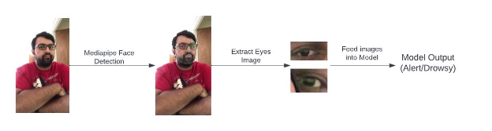
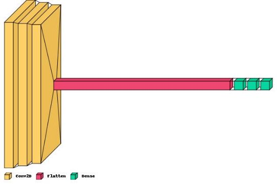

**Driver Drowsiness Detection**

**Introduction**

Drivers who do not take breaks when driving for a long time run a risk of becoming drowsy. This can cause accident of the vehicle. According to research 1 in 4 car accidents are attributable to driver becoming drowsy. Which means drowsiness causes more accidents than drunk-driving. According to statistics annually there are 1200 deaths and 76000 injuries because of accidents when the driver is drowsy [1]. The development of a system which can resolve the driver drowsiness issue remains a major problem in the field of accident avoidance system. One way to detect drowsiness is to monitor driver’s eyes continuously and alert the driver when driver’s eyes are partially/completely closed for a significant amount of time. To alert the driver of drowsiness, a system was developed which can monitor the driver’s face with a camera throughout the journey and alert the driver when the driver is drowsy. The block diagram of this approach is shown in Fig-1.

Fig-1 Driver Drowsiness Detection System Overview

**Drowsiness Detection System**

The Drowsiness Detection System focuses on driver’s eyes. When the eyes of the driver are partially/completely closed for a significant amount of time, it classifies the driver as drowsy. If the system classifies the driver as drowsy, an alarm system can be developed to alert the driver. This system was developed using deep learning technologies. A camera was used to monitor the driver’s face continuously. The eyes of the driver were detected by using Google’s MediaPipe face detection technique [2]. The cropped images of the eyes were fed to the custom trained model. The custom model was trained using CNN (Convolutional Neural Networks) [3] and MLP (Multi-layered Perceptrons) [4]. CNN takes image as input and tries to find patterns in the images. In MLP, the inputs are vectors, on which certain computations are done to determine the output. This system was developed by using combination of CNN and MLP. The dataset for this model was collected and labeled manually from various video sources [5]. The block diagram of this appraoch is shown in Fig-2.

Fig-2 Driver Drowsiness Detection System (Under the hood) **The Custom Trained Model**

The deep learning model was trained using combination of CNN and MLP. There were three Convolutional layers followed by a Flatten layer and three layers of Fully-connected neurons (MLP). The architecture of the model is shown in Fig-3.

Fig-3 Architecture of The Model

The training data consisted of 1707 well balanced images of both classes and the validation data consisted of 732 images. The model was trained on 20 epochs with the batch size of 20. The accuracy of the model after training on both sets -

|Training Set|99.7%|
| - | - |
|Validation Set|95.9%|

**Limitations of the Model**

Despite giving good performance on train set and validation set, the model still has some limitations which are -

1. When the driver is wearing sunglasses, the eyes will not be visible. In this case, the model will not be able to give correct predictions. For this scenario, different techniques of drowsiness detection (Steering Vehicle Monitoring etc.) must be used.
1. Due to limited data, the model was giving poor prediction on some scenarios. For example - The model seemed to give poor performance on people of Chinese origin, because the training set consisted people of Indian and American origin. This problem can be solved by increasing the size of the dataset which will almost include people of different origins.

**Conclusion**

A driver drowsiness detection system was developed which focuses on eyes of the driver and alerts the driver if the eyes of the driver are partially/completely closed. The system was developed using deep learning technologies like CNN and MLP. The system also uses Google’s MediaPipe Face Detection Technique. The model was trained on dataset obtained from various sources. The dataset was labeled manually. The model was giving good performance on the training and validation sets. It still has some limitations which can be solved by taking appropriate measures.

**References**

1. Vandna Saini, Rekha Saini, Driver Drowsiness Detection System and Techniques: A Review
1. Google’s Mediapipe Face Detection, https://github.com/google/mediapipe/wiki/MediaPipe-Face-Mesh
1. Keiron O'Shea, Ryan Nash, An Introduction to Convolutional Neural Networks
1. Hassan Ramchoun, Mohammed Amine Janati Idrissi, Youssef Ghanou, Mohamed Ettaouil, Multilayer Perceptron: Architecture Optimization and Training
1. Real life drowsiness dataset, <https://sites.google.com/view/utarldd/home>
